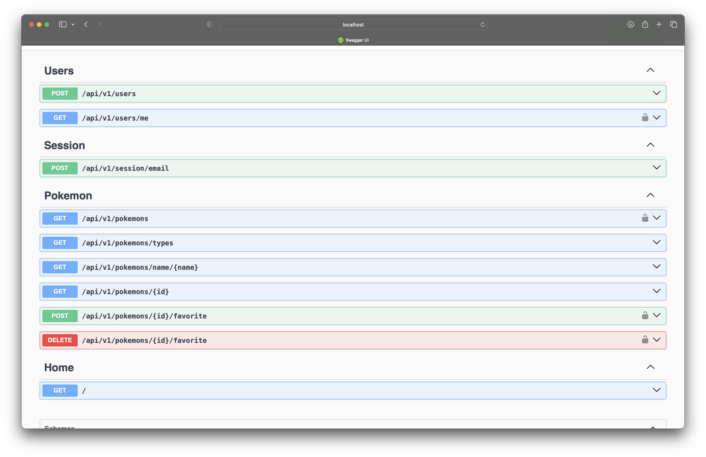
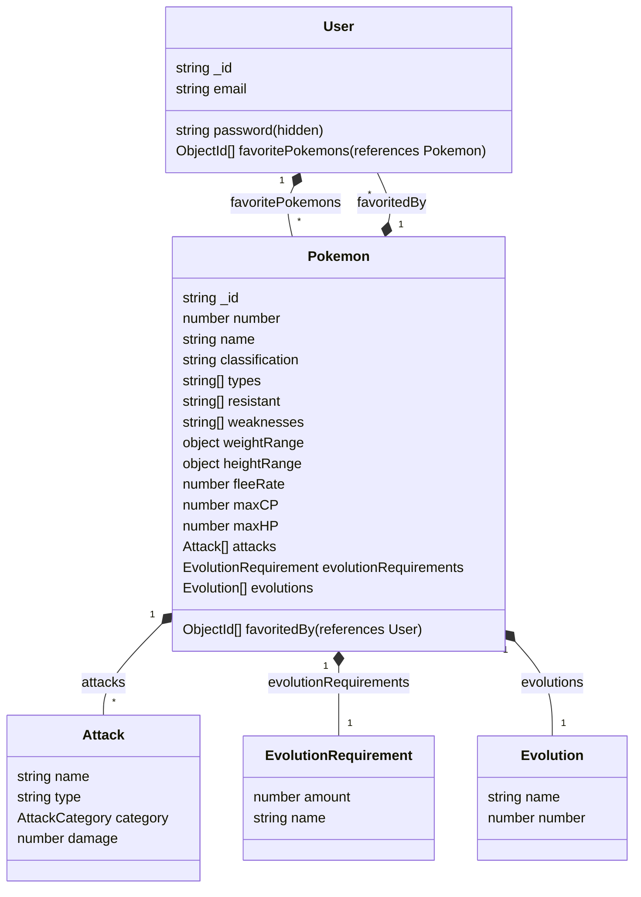

# Pokemon API




## Table of Contents

- [Setup](#setup)
- [Development](#development)
- [Database](#database)
- [Testing](#testing)

## Run with Docker

```bash
docker-compose up
```

**Note:** By default it uses `.env.template`.

## Setup

1. Install dependencies: `make install` (the project uses [yarn](https://github.com/yarnpkg))
2. Create local environment file: `cp .env.template .env`
3. Run infrastructure `make infra`
4. Run development server: `make develop`

## Development

- `make infra` - start postgres docker container
- `make develop` - start development server
- `make type-check` - run type checking
- `make lint-fix` - run linter
- `make format` - run prettier

## Database

- `make seed-database` - truncate all tables and seed database with initial data



## Testing

Most of the tests are E2E tests and require connection to the database.

- `make test` - run all tests
- `make coverage` - run test coverage
